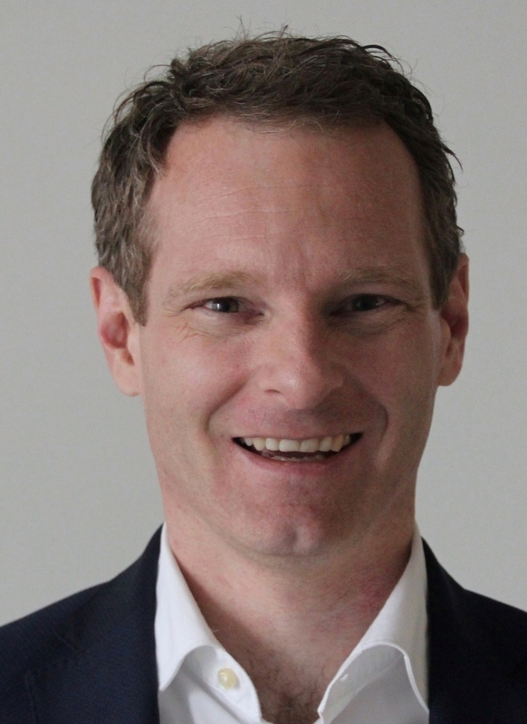

## Message from the Chair of the Board

{.person}

Dear OpenRail Community,

In January 2024, we proudly launched the OpenRail Association. As a founding member, I am privileged to reflect on a year of significant growth and the establishment of strong relationships. We've set the foundation for collaborative efforts worldwide and secured a robust financial base through contributions from our members.

**Challenges and Solutions in Railways**

Railways are essential for sustainable mobility, with digitalization driving our future. Country-specific developments have led to isolated software systems. Traditional cooperation methods are lengthy and cumbersome. The OpenRail Association aims to revolutionize this by promoting low barrier community based open source approach to enhance interoperability, efficiency, and innovation.

**Achievements in Our First Year**

* **Community Growth:** We've welcomed four founding members and four/five early adopters from the railway sector.
* **Project Initiatives:** We initiated five projects focusing on infrastructure simulation, condition monitoring, and network planning.
* **Open Governance:** We've established an incubation process for projects, adhering to open source best practices and meeting sector-specific needs.
* **Ecosystem Connections:** We've fostered connections between open source communities and railway professionals through conferences and partnerships.

**Breaking Barriers, Creating Opportunities**

Addressing a prevalent industry concern — "Railways are unique; open source won’t work" — we observe substantial successes in sectors like automotive, telecom, and energy, where open collaboration offers significant benefits by increasing flexibility, efficiency, and innovation. To unlock these benefits for the railway sector, we are focusing on the adoption of OpenRail projects and building strong partnerships within the sector in 2025.

I am excited for the year ahead.  Together we will unlock substantial synergies that will benefit the entire railway sector.

Yours sincerely,

Jochen Decker, Chair of the Board of Directors, OpenRail Association, CIO at SBB
