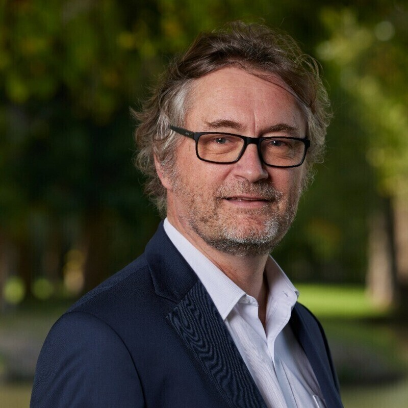

### Frédéric Novello

{.person}

"At SNCF Group, we believe that open source will continue to gain momentum and become a major part of our software portfolio. Beyond the open middleware that we increasingly integrate into our platforms, we still need to accelerate the adoption of open source for business software. Open Rail provides us with a fantastic opportunity to move in that direction within the railway community, and we are proud to lead the OSRD project, which was the first to be hosted by Open Rail!" -- Frédéric Novello, *Vice-Chair*, Deputy Group CIO at **SNCF**
