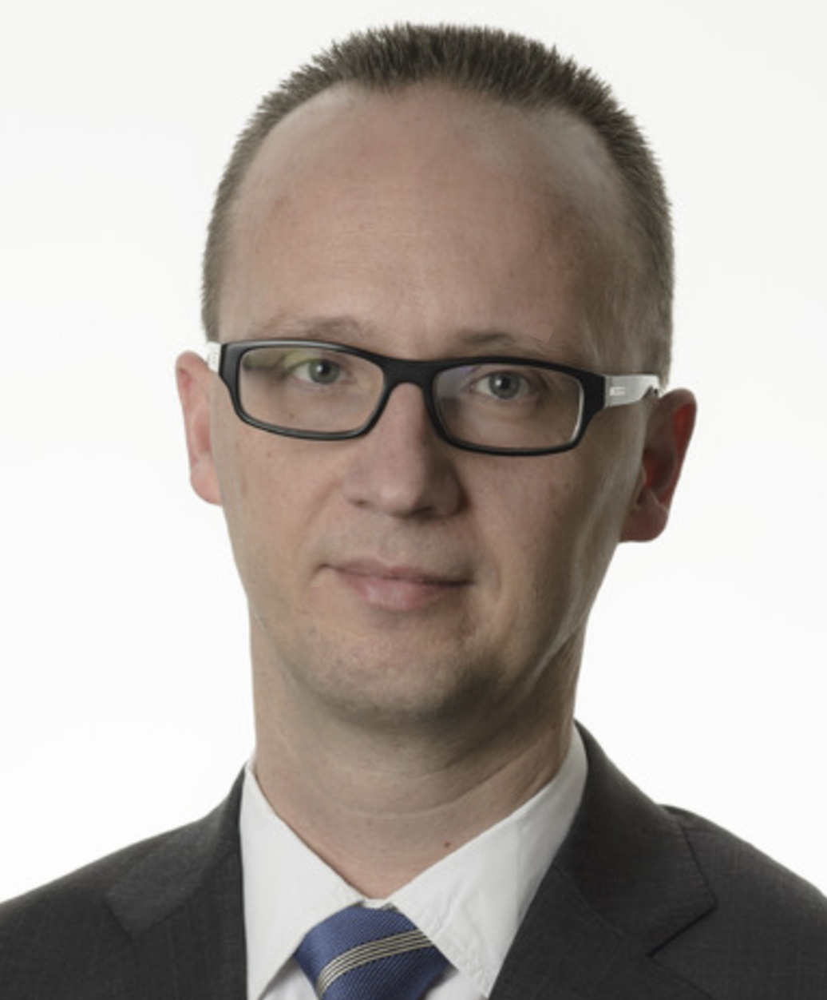

### Peter Franken

{.person}

"Digitalization is a key enabler for Infrabel. When we joined the association and started exploring the list of open source projects that are hosted by OpenRail, we quickly realized that there is almost complete alignment with our own digital roadmap. On top of that, the OpenRail team is made up of highly professional and experienced subject matter experts, eager to help newcomers at any stage of the process." -- Peter Franken, *Director*, Deputy CIO, Head of Real Time & End User Solutions at **Infrabel**
