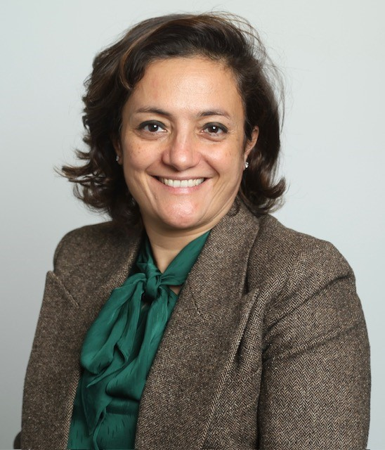

### Fatima Zohra El Ouerkhaoui

{.person}

"As we all know, almost all railway sector companies face challenges in developing complex specialized in house systems  because of the lack of standard systems. That’s why the existence of an association as Open Rail Association was necessary, to create the right environment for building standardized solutions and leveraging all the advantages of open-source technologies. At ONCF, we strongly believe this is a golden opportunity to establish strong, standardized, and interoperable railway operations. We are proud to be part of it, and convinced that together by contributing and operating building blocks as OSRD for example, we will be reshaping, protecting, and reinforcing the ecosystem of Railway IT Operation Systems with open source standards." -- Fatima Zohra El Ouerkhaoui, *Director*, Chief Information and Digital Officer, Board member at **ONCF**
