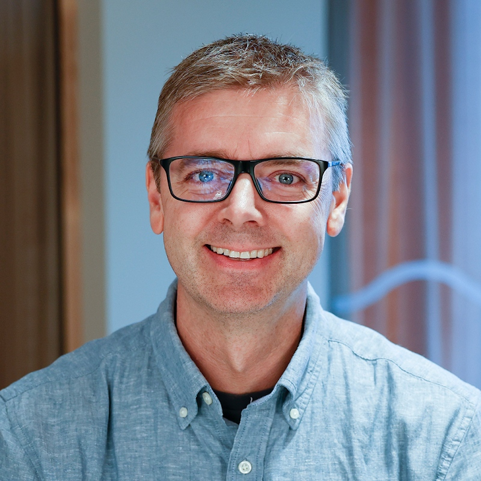

### Brede Dammen

{.person}

"What excites me about OpenRail is how open source and a joint data model and standards let us tackle big challenges together. Entur has shown how powerful this approach can be — building scalable, future-proof, and truly interoperable national infrastructure. With the upcoming TSI Telematics, we have a chance to support railway undertakings in the best way possible. In the end, we’re all trying to solve the same problems — so why not join forces and do it the right way?" -- Brede Dammen, *Director*, Product owner, national journey planner at **Entur**
