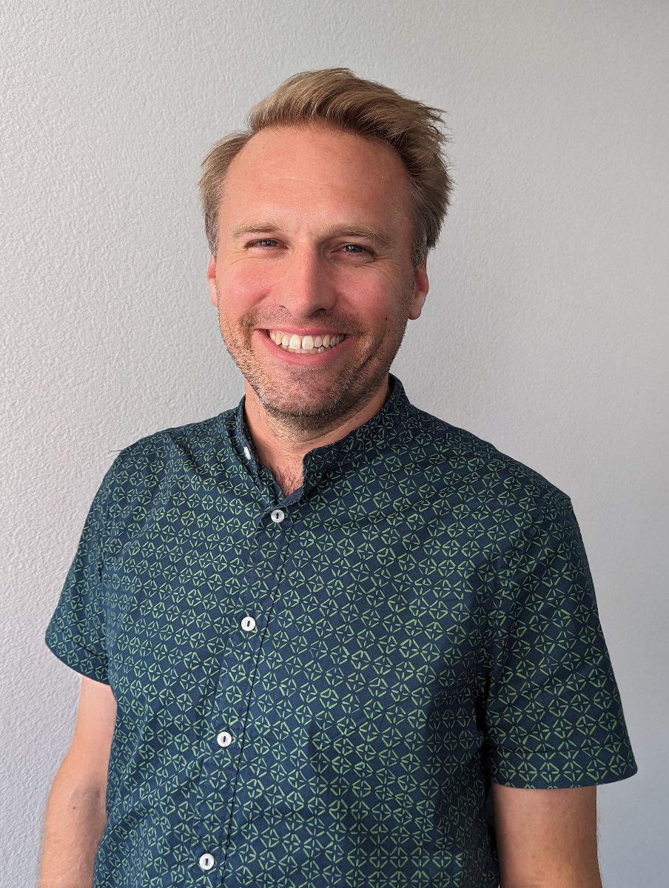

### Erik Nygren

{.person}

"I believe that open research creates powerful opportunities for innovation across critical infrastructure domains. At the Flatland Association, we've observed valuable cross-pollination of ideas between railway operations and other sectors like energy and aviation through our open research initiatives. Our collaboration with the OpenRail Association strengthens this ecosystem through activities like open source project hosting and helps translate research results into practical applications that improve transportation systems for everyone." -- Erik Nygren, *Director*, President at **Flatland Association**
