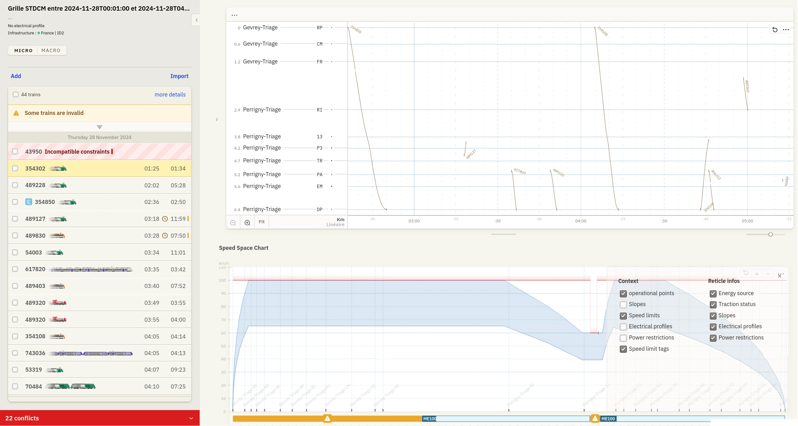
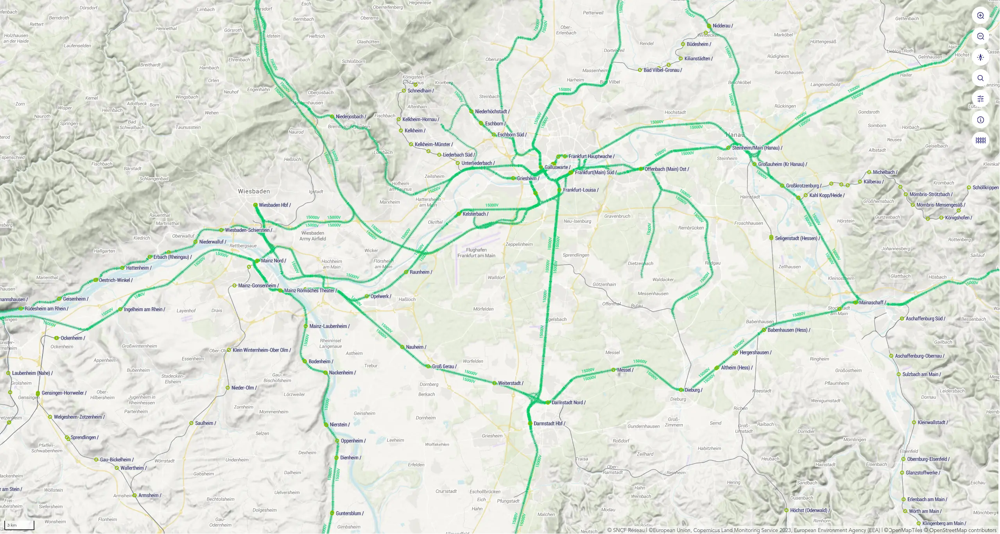

### Open Source Railway Designer {.project}

**Open Source Railway Designer (OSRD) is a web application designed to simulate and visualize train capacity on prospective infrastructures, supporting both operational studies and short-term capacity management. Operational studies assess the ability of infrastructures to meet demand and balance capacity with transportation needs, aiding in informed public infrastructure investment decisions. Short-term capacity management, driven by the growing demand for rail freight, requires quick responses to freight train path requests, necessitating an automated tool.**

OSRD's core features include running time calculation, signaling and conflict simulation, infrastructure editing, and rolling stock editing. Its key strengths lie in simulation speed, with short-term dynamic capacity management (STDCM) results found in less than a minute and the ability to load large timetables with over 15,000 trains in a single scenario. The interface is designed to be simple and visually pleasing, enhancing user results.

The technology stack for OSRD includes Kotlin and Java for the core backend, Rust (axum) for Editoast and Osrdyne components, Rust (Actix Web) for the gateway, RabbitMQ as the message broker, PostgreSQL and Valkey for databases, and React for the frontend.

OSRD is deployed at SNCF Réseau and used by four railway companies and approximately 25 railway study operators. The project collaborates closely with Netzgrafik-Editor, which has been integrated into the application. External contributions are handled, and frontend components are designed to be importable into other projects, with some already starting to use them.

OSRD follows a frequent release cycle, averaging two [releases](https://github.com/OpenRailAssociation/osrd/releases) per month. In 2024, these included several major milestones: a revamped user interface with brand-new components, streamlined timetable import and export, and significant stability improvements, enabling the first users to access the application.

Looking ahead, OSRD aims to have 40 companies using it for STDCM by the end of March 2025, with more railway study operators at SNCF Réseau adopting the tool. There is also interest from several infrastructure managers other than SNCF Réseau. Future enhancements include handling paced trains in timetables, adding signaling systems like European Train Control System (ETCS), and improving STDCM by managing overtakes. A key milestones for 2025 is having a public sandbox environment where anyone can try OSRD. This will provide visibility and contributions to the project.

Further information:

* [OSRD Github page](https://github.com/OpenRailAssociation/osrd)
* [OSRD website](https://osrd.fr/en/)
* [OSRD documentation](https://osrd.fr/en/docs/)

