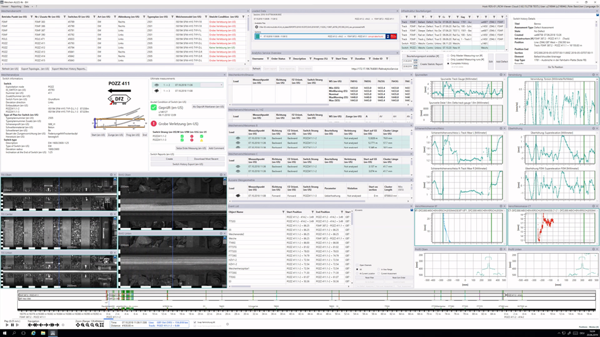
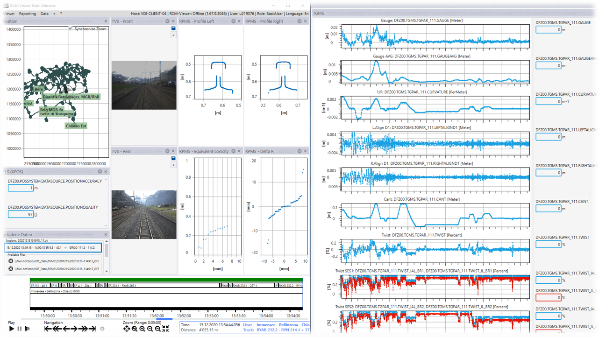

### Rail Condition Monitoring {.project}

**RCM by SBB comprises a suite of products for Rail Condition Monitoring. Based on the data format RCM-DX (RCM Data eXchange), RCM enables easy accessibility and visualization of railway diagnostic data. The aim of RCM OSS (open source software) is to make rail condition data easy to access, store and visualize. Therefore, RCM OSS is beneficial to railway companies as well as suppliers of measurement system.**

The RCM-DX file format is available open source. With RCM-DX we step away from proprietary data formats which require specialized software and know-how, towards a self-contained and open format. RCM-DX can be accessed through standard HDF5 tools. We recently added an open source MATLAB function to facilitate more specific reading of RCM-DX files. The accompanying visualization software, RCM-DX Viewer, is available as freeware.

RCM-DX is used by SBB to store, manage and exchange diagnostic data. SBB exchanges with and delivers diagnostic data to other Swiss railway companies and universities. Infrabel and SNCF réseau are in the process of establishing RCM-DX for storing diagnostic data in future.
In the ERC project Europe’s rail, RCM-DX is being evaluated as a candidate for a European data format to store and exchange railway diagnostic data. Its properties bear great potential for every railway company to be independent of proprietary software and therefore in full control of their data as well as to facilitate data exchange across companies and countries. The full potential of RCM OSS will be released with the publication of an open source Read/Write library and the open source RCM-DX Viewer in future.

RCM OSS has been accepted as a project at the OpenRail Association in 2024. RCM-DX, accompanied by a facilitating MATLAB function are available as open source. The RCM-DX Viewer including sample data are available as freeware. The publication of an RCM-DX R/W library is aimed for in 2027.

Further information:

* [RCM DX Viewer](https://bahninfrastruktur.sbb.ch/en/products-and-services/bahninformatiksysteme/anlagenmanagement/rail-condition-monitoring.html)
* [RCM OSS on GitHub](https://github.com/OpenRailAssociation/rcm-dx)
* [RCM DX Examples](https://github.com/OpenRailAssociation/rcm-dx-examples)
* [Talk about RCM OSS at FOSDEM](https://archive.fosdem.org/2023/schedule/event/rot_rcmdx/)

