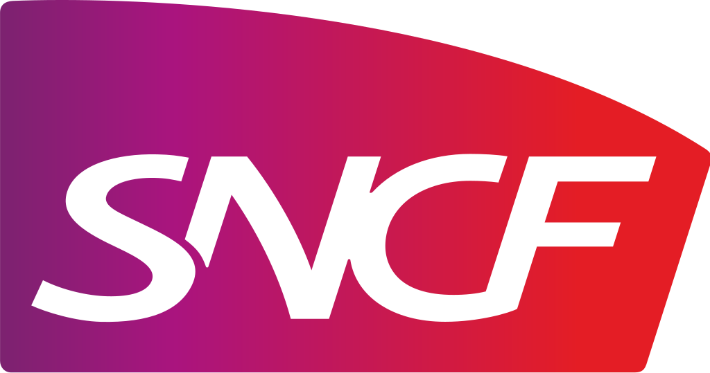

## Members

We are grateful to our members for their commitment to open collaboration in the railway sector. Their engagement and support drive the success of the OpenRail Association, helping to build a strong, sustainable, and innovative open-source ecosystem. The following organizations are part of this movement.

### Platinum

{.member-logo}
{.member-logo}
{.member-logo}
{.member-logo}

### Gold

{.member-logo}
{.member-logo}

### Silver

{.member-logo}

### Associate

{.member-logo}
