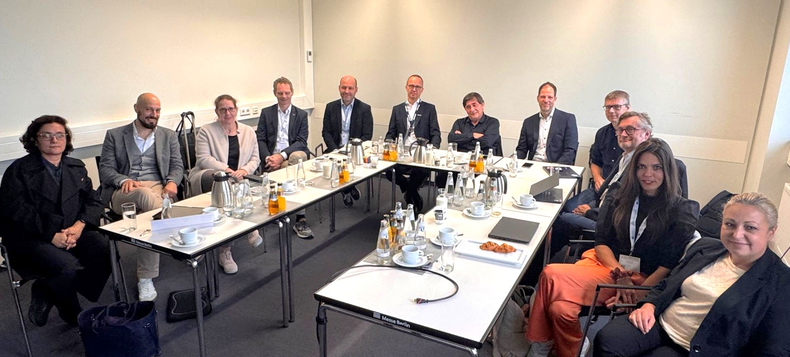

## Building the Organization

*2024 has been the year of building up the organization. Tell the story, significant milestones, use it to mention the important organizational parts, link to where to find more information, such as governance documents.*

The OpenRail Association was officially incorporated as an international non-profit organization (AISBL) under Belgian law by royal decree on **January 7, 2024**.

Operations formally began with the **first meeting of the Board of Directors in Paris on January 29**. The initial board consisted of the directors appointed by the founding members: **SBB, DB, SNCF, and UIC**. Over the course of the year, we established a rhythm of **quarterly board meetings**, held as hybrid or virtual sessions. A milestone was reached in September when we managed to bring everyone together in person for a board meeting at **InnoTrans, the major railway trade show in Berlin**. With new members joining throughout the year, participation expanded, and by the end of 2024, **all membership categories were represented on the board**.

In **June**, we held our **first General Assembly**, bringing together all members of the OpenRail Association. At this early stage, all members were also represented on the board, making this first assembly largely a formal step. However, as membership grows, the General Assembly will take on a more significant role as the **ultimate decision-making body of the association**.

To handle operational and administrative work, we established the **OpenRail Team** as a working body by board decision at the January meeting. This **small group, currently composed of representatives from the founding members**, manages the practical work necessary to run the association. Their responsibilities include **preparing board and general assembly meetings, handling member applications, and discussing strategic direction and activities**.

All of these structures serve a single purpose: **to enable successful open-source projects in the railway sector**. A crucial role in this is played by the **Technical Committee**, which acts as the bridge between the association and the projects.

In its first year, OpenRail developed a **productive and transparent working mode**. **Weekly meetings of the OpenRail Team and the Technical Committee serve as the heartbeat of the organization.** We are committed to openness—our projects are publicly available on **GitHub**, and the **Technical Committee publishes all meeting notes and works collaboratively on incubation processes, project support, and other deliverables**.

Looking ahead to **2025**, we will continue to **scale and iteratively improve** how we work. Our approach remains **hands-on, driven by the active engagement of the individuals present in working groups and projects**. True to the open source spirit, **“Those who do the work decide.”**
