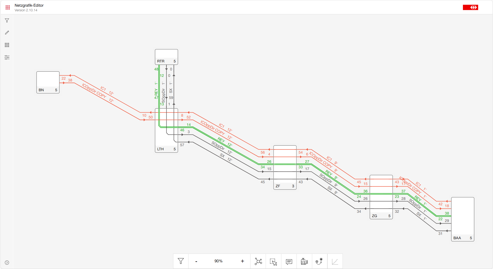
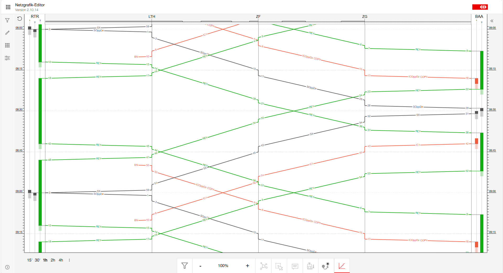
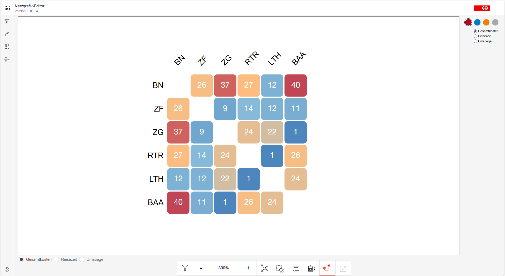
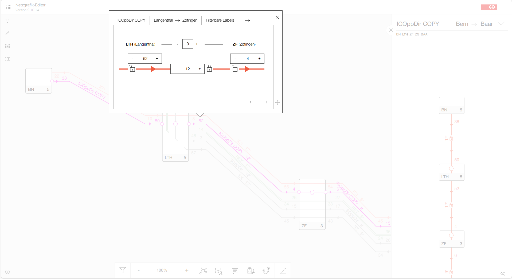

### Netzgrafik-Editor - Shared Path Creates Shared Value

```
If you want to go fast, go alone.
If you want to go far, go together.
— African proverb
```

#### Open Source as a Shared Path

The Netzgrafik-Editor serves as an example of a software solution that was originally created by a single railway company — the Swiss Federal Railways (SBB) — in response to a capability gap not addressed by existing market offerings. Available planning tools did not support the early-stage development of strategic long-term timetable and service concepts, nor did they enable planners to efficiently model, analyze, and iteratively test network-level service scenarios. This reflects a broader pattern across the railway industry: challenges are complex, markets are small, and specialized tools are often developed in isolation.

At this stage, the Netzgrafik-Editor was already being used for planning tasks within daily business operations when the idea of publishing the software as open source was first raised. The underlying assumption was that other railway companies — and potentially educational institutions — might face similar planning challenges and could benefit from a shared solution. However, there was limited experience in publishing software that directly supports core business processes, as previous open source contributions had typically focused on technical tooling for IT specialists. After internal discussions, it became clear that the risks of opening the software were low, while the potential benefits of collaboration were significant. At this point, the support and expertise of colleagues from the OpenRail Association proved essential.

#### Building Trust and Community

Early interest from the [OSRD](https://osrd.fr) team at SNCF played a key role in shaping the initial phase of the Netzgrafik-Editor as an open source project. Establishing trust through direct, in-person exchange proved essential in forming the foundation for this collaboration. The OSRD team — itself deeply rooted in open source principles and values — brought both commitment and practical experience in collaborative development, which supported the emergence of a broader community around the Netzgrafik-Editor.

Through active community building, we attracted additional adopters and development partners. It was hard work, but the results are tangible — today, the project benefits from a diverse community of software developers, planners, designers, students, and enthusiasts. Half of the commits now originate outside SBB. Such a broad and interdisciplinary community is an important prerequisite for advancing open innovation in the railway sector.

To generate interest among the user community, we provided — in addition to publishing the source code — a fully functional, publicly accessible [demo instance](https://openrailassociation.github.io/netzgrafik-editor-frontend/) with the support of the [Flatland Association](https://flatland-association.org), an associated member of the OpenRail Association. These users actively participate in the project by integrating the tool into their daily workflows, providing direct feedback, and introducing feature requests grounded in real-world operational needs. This user perspective is essential for the continuous improvement of the project.

#### Conclusions for Domain-Driven Open Source Projects

Opening the Netzgrafik-Editor has measurably changed how the tool evolves and how planning knowledge is shared across organizational boundaries. What began as an internal innovation project has developed into a collaborative solution that benefits from contributions across companies and disciplines.

Based on this experience, several conclusions may be relevant for similar domain-driven open source projects in the railway sector:

- Releasing business-critical tools as open source is a viable strategy when market solutions are unavailable or insufficient — or when seeking to avoid vendor lock-in.
- Collaborative development across organizations enables the implementation of new features that would be difficult to realize within a single organizational context.
- Collaboration across organizational boundaries reduces duplicated effort and supports interoperability between planning tools.
- Integrating user feedback from operational environments improves practical applicability.
- Transparency and openness support trust-building between organizations and partners.
- Open collaboration enables innovation beyond the capabilities of a single company.

If you want to go far, go together with open source values and principles.








