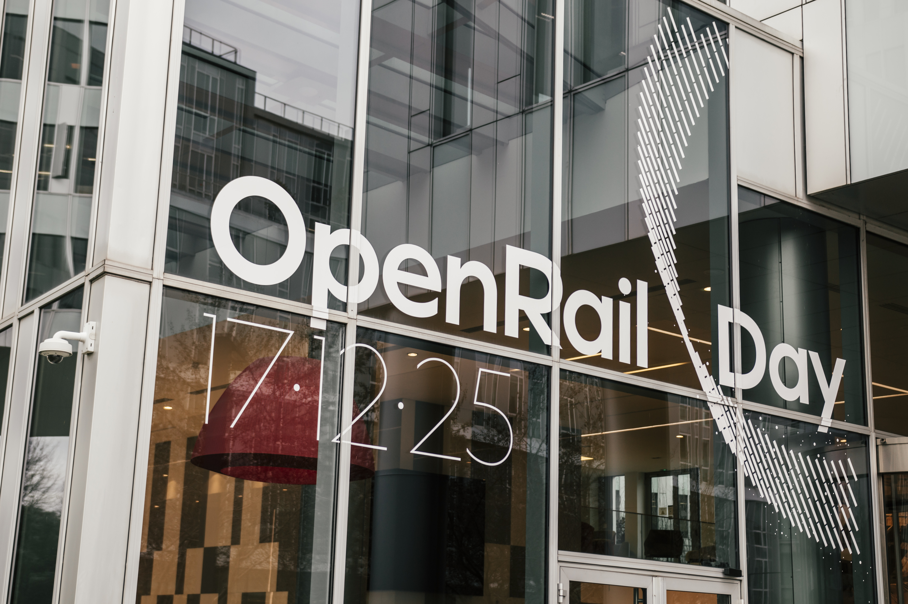
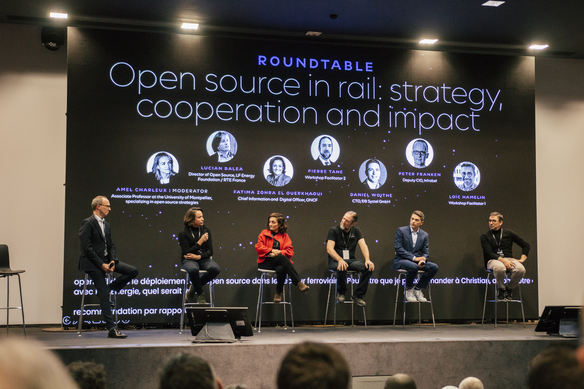
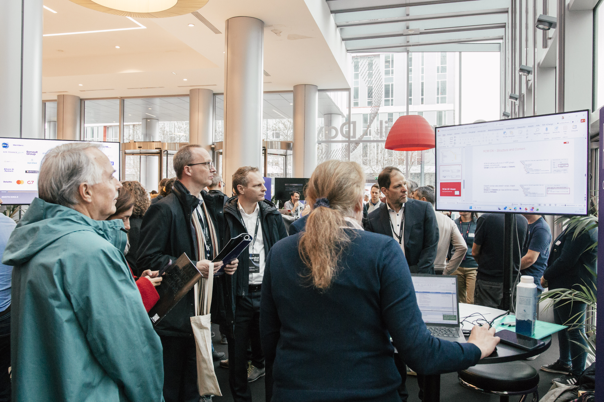

## Community and Ecosystem

### OpenRail Day @Paris - Collaboration in Practice

With OpenRail Day 2025 in Paris, the OpenRail Association brought its community together in person at scale for the first time. On December 17th 2025, hundreds of participants joined for a full day of workshops, conference sessions, and networking, demonstrating that OpenRail has evolved into a visible and growing ecosystem.

Participants explored the OpenRail projects at dedicated stands, learned about recent developments and upcoming plans in presentations, and engaged directly with developers and contributors. The event made tangible what OpenRail stands for: practical collaboration around shared digital building blocks for the railway sector.

One highlight of the conference was the keynote by **Jochen Decker**, Chair of the OpenRail Association, who outlined the common digital challenges faced by railway operators and infrastructure managers and emphasized the role of open source in addressing them through transparency, shared development, and interoperability. **François Davenne**, UIC Director General, reinforced the importance of open collaboration at an international level and positioned OpenRail as a concrete enabler of interoperability across organizations and borders in his [keynote](https://clip.place/w/p/gZ1HFxLxHri8mDABzqpGHC?playlistPosition=3&resume=true).

In a [panel discussion](https://clip.place/w/p/gZ1HFxLxHri8mDABzqpGHC?playlistPosition=9&resume=true) with **Lucian Balea** (LF Energy, RTE France), **Fatima Zohra EL Ouerkhaoui** (ONCF), **Daniel Woithe** (DB Systel), **Peter Franken** (Infrabel), **Pierre Tane** (UIC), and **Loïc Hamelin** (SNCF), moderated by **Amel Charleux** (University of Montpellier), the discussion focused on lessons learned from other industries and how open collaboration in the railway sector can be structured for long-term success. The conversation made clear that open source in rail is no longer experimental, it is becoming operational.

The European Commission’s Open Source Program Office contributed a European perspective on digital sovereignty, interoperability, and cross-sector collaboration, represented by **Miguel Díez Blanco** and **Catalin Moruju**. This underlined that OpenRail’s work is aligned with broader European ambitions for resilient and interoperable digital infrastructure, as shared in their [presentation](https://clip.place/w/p/gZ1HFxLxHri8mDABzqpGHC?playlistPosition=10&resume=true).

But beyond the stage program, the most important element was direct exchange. Developers, decision-makers, and contributors met at project stands and in informal conversations. Many met in person for the first time after months of virtual collaboration. These interactions strengthened trust, created new connections, and turned shared code into shared community.

OpenRail Day demonstrated that the ecosystem is active, connected, and growing — and that collaboration in practice is the foundation for sustainable digital transformation in the railway sector.
