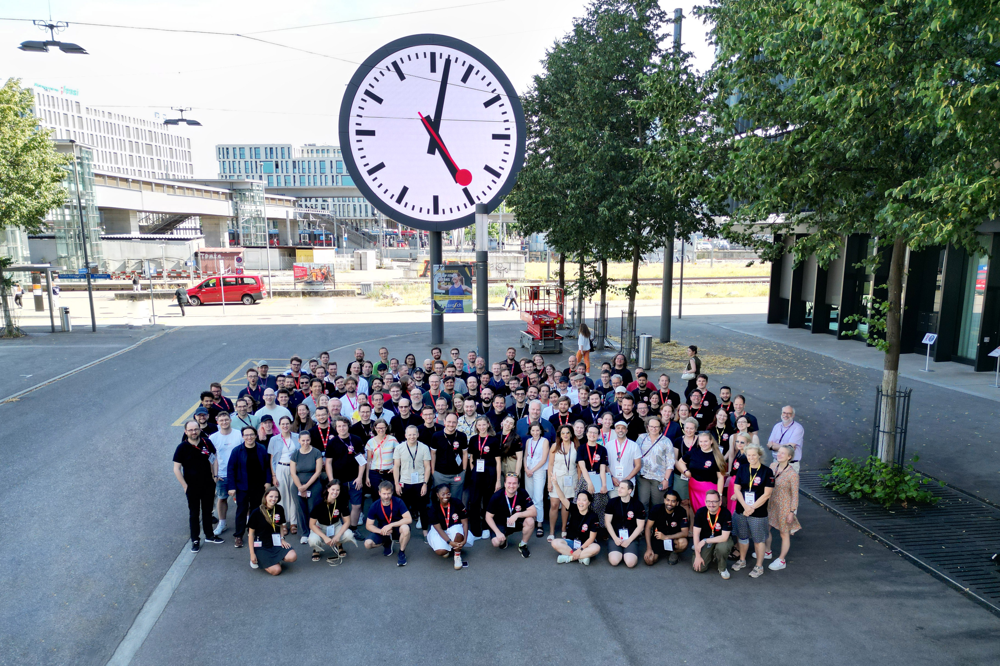

### Hack4Rail 2025 in Bern - Innovation through Open Source

OpenRail Association partnered Hack4Rail 2025, hosted by SBB, which took place from June 23 to 25 in Bern, Switzerland. The hackathon brought together around 170 creative minds from the railway industry, including members from DB, Flatland Association, Infrabel, ÖBB, SBB, and SNCF, working in 21 interdisciplinary teams to tackle some of the key challenges faced by rail operators and infrastructure managers today.

With the theme "Connected Railways for Intelligent Solutions", Hack4Rail focused on multinational collaboration and open source solutions. OpenRail Association contributed by providing technical infrastructure, financial support, and a collaborative space on GitHub, while its members brought in real-world challenges and actively collaborated within the teams, helping to open-source these challenges from the very beginning. The teams' open way of working ensured that results remain transparent and easy to build upon beyond the event itself, making the work carried out during the hackathon more sustainable over time.

The response was overwhelmingly positive, with many challenges naturally initiating as open source projects. This approach aligns with our vision to foster cooperation, openness, and shared growth in the digital transformation of railways. Participants were encouraged to explore and adapt innovative models, leveraging open data to drive progress across the industry.

The hackathon showcased impressive solutions to real-world rail challenges through collaborative efforts:
- Brave New Station: Enhanced passenger count analysis at stations using near-real-time data for improved safety and operational efficiency.
- LoCo2 LoCo: A smart CO₂ dashboard for real-time emissions tracking, promoting sustainable travel strategies.
- Trip HackerZ: Personalized travel solutions using natural language processing to tailor travel experiences to individual needs.
- Parametric Travelers: A tool that recommends travel options based on personalized criteria, encouraging exploration of lesser-known connections.
These winning projects exemplify the transformative potential of open source collaboration, which OpenRail Association is committed to nurturing. By collaborating and sharing insights, the railway industry can accelerate innovation and achieve more efficient and interoperable solutions.

We look forward to continuing this journey and exploring new opportunities to connect and innovate with our members and partners at [Hack4Rail 2026 in Vienna](https://bcc.oebb.at/de/das-leisten-wir/innovationen/projekte-innovationen/hack4rail/hack4rail-2026-en). For an engaging recap of Hack4Rail 2025, we invite you to watch the event [video](https://youtu.be/F_wM7T0TsnQ).
