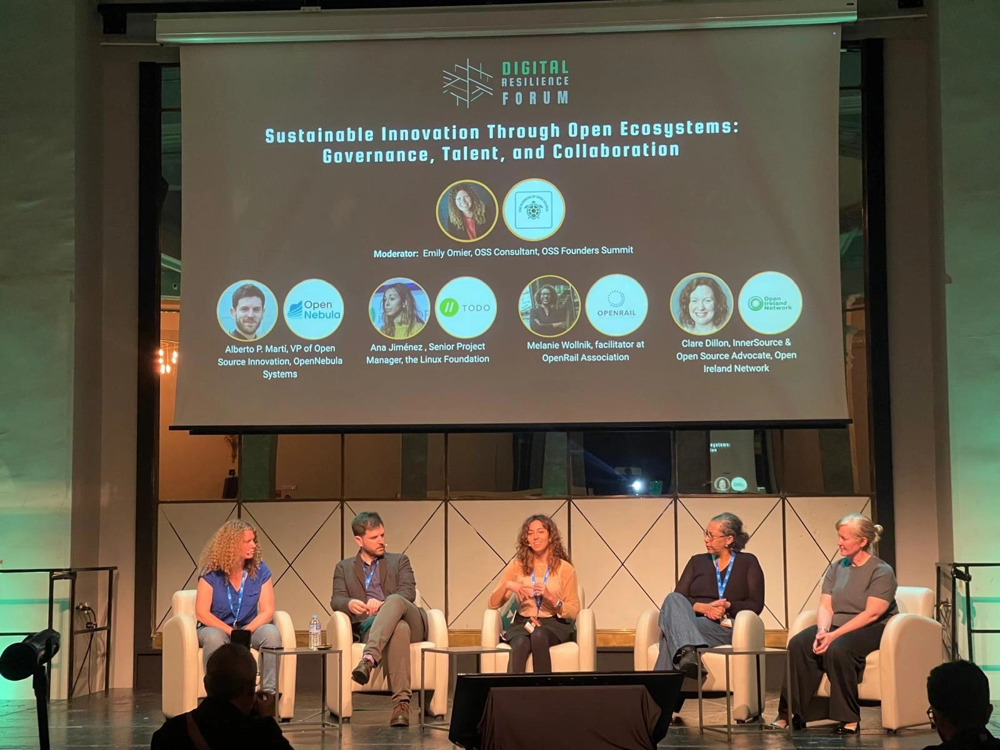

### Digital Resilience - Strategic Outlook

For railway operators and infrastructure managers, digital resilience is no longer an abstract concept. Dependencies in software and digital infrastructure directly affect operational flexibility, long-term planning, and the ability to adapt.

Recent geopolitical developments have highlighted the risks of structural dependencies in digital infrastructure. At the same time, many organizations have experienced firsthand what it means to rely on single vendors and how difficult it can be to regain agency once critical systems are locked in. As a result, the ability to make self-determined decisions in a globally interconnected digital environment has become a strategic priority.

Open source plays a central role in addressing this challenge. Transparency, neutral governance models, and collaborative development across organizational boundaries create the conditions for choice and interoperability. By enabling competitors to collaborate on shared building blocks, open source strengthens markets, reduces dependency risks, and increases resilience.

The OpenRail mission to establish a broad ecosystem of open source software for the railway sector directly contributes to this objective. A shared, openly governed software foundation increases flexibility for operators, infrastructure managers, and vendors alike. It provides practical alternatives, reduces lock-in risks, and enables informed technological decisions. In this sense, digital sovereignty is not an additional topic for OpenRail. It is embedded in its core mission.

Digital sovereignty does not mean isolation or self-sufficiency. It means building on globally developed, transparently governed software that can be adapted, operated, and further developed according to local needs. Open collaboration and local agency are not contradictions. They reinforce each other.

Open source alone does not automatically create sovereignty, but sovereignty cannot be achieved without open source. Access to code, the right to modify, and the ability to collaborate openly are fundamental prerequisites for technological self-determination.

In 2025, OpenRail actively contributed to the broader discussion on digital resilience. In October, we participated in the [Digital Resilience Forum](https://digitalresilienceforum.com/) in Madrid, where leaders from multiple sectors explored practical strategies for strengthening Europe’s digital infrastructure. In November, OpenRail signed the [Declaration of Digital Independence](https://digitalindependence.eu/) on the occasion of the Summit on European Digital Sovereignty in Berlin. We also supported the initiative to establish a [European Sovereign Tech Fund](https://openrailassociation.org/news/2025/openrail-association-calls-for-eu-sovereign-tech-fund/) to provide sustainable funding for critical open source projects that underpin digital infrastructure.

This funding dimension is essential. Open source ecosystems thrive when there is a healthy balance between using and contributing. Sustainable digital infrastructure requires not only adoption, but also long-term investment.

The discussion on digital sovereignty will continue to evolve. OpenRail will remain engaged, both in shaping the dialogue and in strengthening resilient and openly governed digital foundations for the railway sector.
