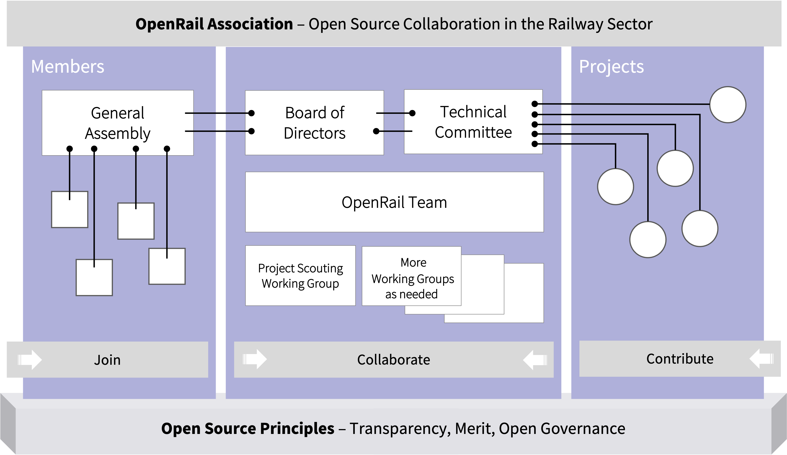

## The Association

### How the OpenRail Association Works

The OpenRail Association provides a neutral space for shared development and governance of software in the railway sector. It is firmly rooted in open source principles and open to the entire railway ecosystem. OpenRail connects member organizations and open source projects within a structured and reliable framework.

There are several ways to engage: join as a member, collaborate in a working group, or initiate or contribute to an OpenRail open source project.

Member organizations are represented in the General Assembly, which elects the Board of Directors. These statutory bodies define the strategic direction of the association and ensure its long-term stability.

OpenRail projects are represented in the Technical Committee. The Technical Committee provides overall guidance based on open source principles and ensures that projects follow an open governance model and keep a high level of quality. Contributions are open to anyone. You do not have to be a member to use or contribute to OpenRail projects.

The Technical Committee forms the institutional bridge between member organizations and projects. Its chair is an ex officio member of the Board of Directors, and the Board appoints a limited number of additional members. The majority of the Technical Committee consists of representatives from the projects themselves. This structure ensures that projects retain autonomy while remaining aligned with the strategic direction of the association.

Working groups carry out the operational work of the association. They address cross-project topics, support new projects in joining OpenRail, and handle communication and day-to-day activities. The OpenRail Team coordinates and supports these efforts.

OpenRail is a lean organization focused on practical collaboration and long-term sustainability. Participation is open, and engagement is welcome.
